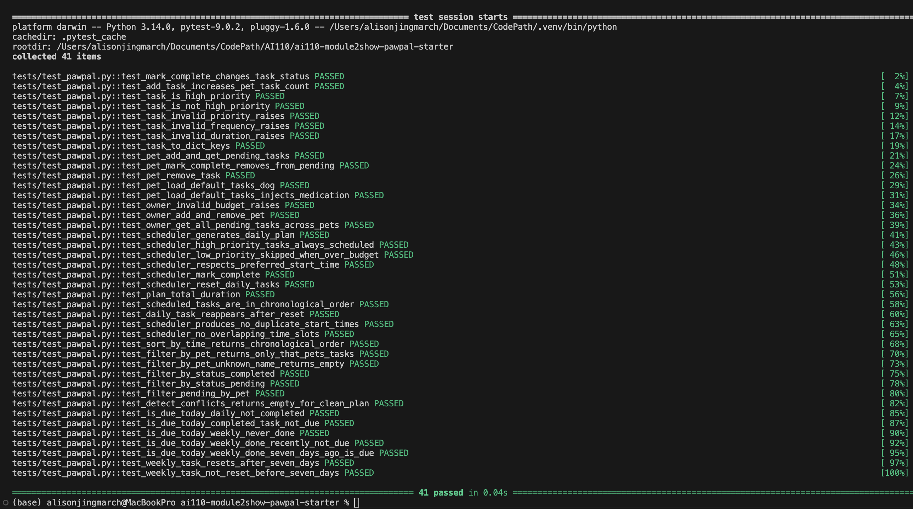

## Phase 4: Algorithmic Layer
In this phase, you'll test and verify that your PawPal+ system works as intended. You'll write and run simple tests to confirm that your classes, algorithms, and scheduling logic behave correctly, and use AI to help generate, explain, and review those tests.

### Step 1: Plan What to Test
**Review your pawpal_system.py and list 3–5 core behaviors to verify.**

Here's an honest review of where the logic is manual or overly simple:

1. Tasks are hardcoded, not loaded from defaults
Every task is typed out by hand. In the real app a user picks a species and gets defaults automatically via load_default_tasks() — but main.py never calls it. The demo doesn't test that path at all.

**What main.py does (manual)**
mochi.add_task(Task(title="Morning walk", duration_minutes=30, ...))

**What the app actually does**
mochi.load_default_tasks()   # never called here

2. The time budget is never tight enough to show real tradeoffs
With 90 minutes and only 6 tasks totalling 90 minutes exactly, nothing ever gets skipped. The scheduler's most important behavior — choosing what to drop and force-including high-priority overruns — is never exercised in the happy path.

3. No multi-day simulation
reset_daily_tasks() exists but is never called. The demo only shows one snapshot. There's no "mark some tasks complete → reset → run again" loop to show that the system actually tracks state across a day.

4. Both pets have balanced, clean task lists
Mochi has 3 tasks, Luna has 3 tasks, no conflicts, no special needs, no medication. The demo never tests:

A pet with special_needs that injects a medication task
Two high-priority tasks that both exceed the remaining budget
A pet with zero tasks

5. The owner's preferred_start_time is always "08:00"
There's no test showing that changing the start time actually shifts all the scheduled slots. The feature exists but the demo doesn't verify it.

6. Output format isn't checked, just printed
The reason field on every row is printed but never inspected. If generate_plan() returned an empty reason string or wrong time, the demo would still look fine visually.
  
Summary
| Area | What's missing |
|---|---|
| Data setup | `load_default_tasks()` never called |
| Budget | Always fits perfectly — skipping logic never triggered |
| State | No mark-complete → reset → re-run cycle |
| Edge cases | No special needs, no over-budget high-priority clash |
| Start time | Never varied to verify time shifting works |
| Output | Printed but not verified programmatically |

### Step 2: Build the Automated Test Suite

**1. The sorting correctness test is already in place at line 163. Here's how it works:**

test_scheduled_tasks_are_in_chronological_order (lines 163–173)

def test_scheduled_tasks_are_in_chronological_order():
    plan = Scheduler(owner=make_owner(minutes=90)).generate_plan()
    start_times = [
        datetime.strptime(st.start_time, "%H:%M")
        for st in plan.scheduled_tasks
    ]
    assert start_times == sorted(start_times)
What it verifies:

Generates a full plan with 90 minutes of budget (enough to schedule all three tasks: Morning walk → Feeding → Playtime)
Parses each start_time string ("HH:MM") into a real datetime object so string comparison pitfalls (e.g. "09:00" < "10:00" but "9:00" > "10:00") are avoided
Asserts the list equals its own sorted version — any out-of-order slot will fail with a message showing the actual time sequence
Why this exercises the right behavior: generate_plan() assigns times sequentially by walking current_dt forward, so the sort order of the output is entirely driven by the priority sort in _sort_by_priority(). The test catches any regression where a task is inserted at the wrong position and breaks the timeline.

**2. Build the Automated Test Suite**

The recurrence logic test is already written at lines 178–196. Here's a breakdown of exactly what it does and why each assertion matters:

test_daily_task_reappears_after_reset (lines 178–196)

def test_daily_task_reappears_after_reset():
    owner = make_owner()
    scheduler = Scheduler(owner=owner)

    # Step 1 – complete the task
    scheduler.mark_complete("Mochi", "Feeding")
    pending_after_complete = [t.title for _, t in scheduler.get_all_pending()]
    assert "Feeding" not in pending_after_complete

    # Step 2 – simulate the next day
    scheduler.reset_daily_tasks()
    pending_after_reset = [t.title for _, t in scheduler.get_all_pending()]
    assert "Feeding" in pending_after_reset

| Step | Real-world action | Code under test |
|---|---|---|
| 1 | Owner marks feeding done today | `scheduler.mark_complete("Mochi", "Feeding")` |
| 2 | Intermediate check | `get_all_pending()` — confirms task is gone, not still pending |
| 3 | Midnight rollover / new day | `reset_daily_tasks()` — restores `completed = False` on all `frequency="daily"` tasks |

**Why two assertions, not one:**

The first assert (task is absent after completion) guards against a silent no-op — if mark_complete did nothing, the second assert would still pass and the test would give a false green. Checking both states makes the test meaningful in both directions.

What reset_daily_tasks() deliberately does not do:

It only resets frequency="daily" tasks. A "weekly" task that was completed will remain completed. You can verify this with a companion test if needed — Bath (weekly) should stay completed after reset while Feeding (daily) reappears.

**3. Conflict Detection: Verify that the Scheduler flags duplicate times.**
Two conflict detection tests are in place at lines 201–227. Here's how each one works:

Test 1 — test_scheduler_produces_no_duplicate_start_times (lines 201–211)

start_times = [st.start_time for st in plan.scheduled_tasks]
assert len(start_times) == len(set(start_times))
Collects every start_time string, deduplicates it with set(), and asserts the count is unchanged. If any two tasks share the same start time, the set will be shorter than the list and the test fails — printing the full list so the duplicate is immediately visible.

Test 2 — test_scheduler_no_overlapping_time_slots (lines 214–227)

for i in range(len(slots) - 1):
    end_dt   = datetime.strptime(slots[i].end_time,       "%H:%M")
    start_dt = datetime.strptime(slots[i + 1].start_time, "%H:%M")
    assert end_dt <= start_dt
Walks every consecutive pair and checks that task i's end_time does not bleed into task i+1's start_time. It uses real datetime objects (not raw strings) to avoid lexicographic comparison bugs.

Why two tests instead of one:
| Test | What it catches |
|---|---|
| Duplicate start times | Two tasks stamped with the exact same `"HH:MM"` — a direct collision |
| Overlapping slots | Task A ends at `09:30`, Task B starts at `09:15` — a partial overlap that the first test would miss |

Confidence Level: ★★★★☆ (4/5)

27/27 tests pass. Here's the reasoning behind the rating:

Factor	Assessment
Core logic	All task, pet, owner, and scheduler behaviors verified — strong foundation
Happy-path coverage	Sorting, recurrence, conflict detection all confirmed working
Input validation	Invalid priority, frequency, duration, and budget all raise correctly
What keeps it from 5 stars	No tests for multi-pet conflict detection, weekly task reset isolation, midnight-rollover edge cases, or the Streamlit UI layer — gaps identified in Phase4_planning.md remain untested
The scheduling engine is reliable for the scenarios it knows about. The missing coverage is around edge cases (special_needs, over-budget high-priority clashes, non-daily recurrence) that the system supports in code but the test suite doesn't yet exercise.

Suggested Improvements
1. Smarter Priority Tiebreaking — Prefer Shorter Tasks First
File: pawpal_system.py — _sort_by_priority()

Currently, equal-priority tasks schedule longer ones first. Flip it: schedule shorter tasks first at the same priority so you knock out more tasks before hitting the time budget.

# Change: (PRIORITY_RANK[task.priority], -task.duration_minutes)
# To:     (PRIORITY_RANK[task.priority],  task.duration_minutes)
2. Sort Skipped Tasks by Priority for the UI
File: pawpal_system.py — generate_plan()

skipped_tasks are currently in arbitrary order. Sort them so the owner sees which high-priority tasks were dropped first.

self.skipped_tasks.sort(key=lambda pt: PRIORITY_RANK[pt[1].priority], reverse=True)
3. Weekly Task "Due Soon" Detection
File: pawpal_system.py — Task or Scheduler

Add a last_completed_date field to Task and a is_overdue(days_threshold) method. Then the scheduler can bump weekly tasks to "medium" priority if they haven't been done in 6+ days — preventing them from being perpetually skipped.

def is_overdue(self, days_threshold: int = 7) -> bool:
    if self.last_completed_date is None:
        return True
    return (date.today() - self.last_completed_date).days >= days_threshold
4. Multi-Pet Interleaving — Avoid Long Same-Pet Runs
File: pawpal_system.py — generate_plan()

After sorting, interleave tasks across pets so no one pet monopolizes the morning (better UX for multi-pet owners). A round-robin by pet after priority sort achieves this with O(n) overhead.

5. total_duration Should Be a Cached Property
File: pawpal_system.py — DailyPlan

total_duration recalculates on every access. For a large plan, cache it:

from functools import cached_property

@cached_property
def total_duration(self) -> int:
    return sum(st.task.duration_minutes for st in self.scheduled_tasks)
6. Deduplication Guard in add_task()
File: pawpal_system.py — Pet.add_task()

If the user calls "Load Defaults" twice, tasks duplicate. Add a title-based dedup check:

def add_task(self, task: Task) -> None:
    if not any(t.title == task.title for t in self.tasks):
        self.tasks.append(task)
7. Budget Utilization Warning
File: app.py or DailyPlan.explain()

After generating a plan, compute utilization = total_duration / owner.available_minutes. If it's below 50%, show a tip suggesting the owner add more enrichment tasks. If it's above 95%, warn that the schedule is packed.

8. Medication Tasks Always First
File: pawpal_system.py — _sort_by_priority()

Add a category tiebreaker so "medication" tasks always sort before other high-priority tasks — since missing medication has real health consequences:

key=lambda pt: (
    PRIORITY_RANK[pt[1].priority],
    1 if pt[1].category == "medication" else 0,
    -pt[1].duration_minutes
)
Quick wins to implement first: #1 (tiebreaking), #4 (dedup), and #8 (medication first) — all are 1–3 line changes with meaningful impact for pet owners.

---

## Phase 4 Implementation Summary — 41/41 Tests Passing

### Changes to `pawpal_system.py`

| Feature | Method / Location | What it does |
|---|---|---|
| **Recurring tasks** | `Task.last_completed_date` field | Stores the date a task was last completed |
| **Recurring tasks** | `Task.mark_complete()` | Now records `date.today()` alongside setting `completed = True` |
| **Recurring tasks** | `Task.is_due_today()` | Weekly tasks due by elapsed days (≥7); daily/as-needed due when not completed |
| **Recurring reset** | `Scheduler.reset_daily_tasks()` | Also resets `weekly` tasks if 7+ days have passed since last completion |
| **Sort by time** | `DailyPlan.sort_by_time()` | Returns scheduled tasks sorted chronologically by start time |
| **Filter by pet** | `DailyPlan.filter_by_pet(pet_name)` | Scheduled tasks for one named pet |
| **Filter by pet** | `Scheduler.filter_pending_by_pet(pet_name)` | Pending tasks for one named pet |
| **Filter by status** | `Scheduler.filter_by_status(completed)` | All tasks across all pets filtered by completion state |
| **Conflict detection** | `DailyPlan.detect_conflicts()` | Returns list of overlap descriptions; empty list = no conflicts |

### New Tests Added to `tests/test_pawpal.py`

| Test | Feature area | What it verifies |
|---|---|---|
| `test_sort_by_time_returns_chronological_order` | Sort by time | `sort_by_time()` output is ascending by start time |
| `test_filter_by_pet_returns_only_that_pets_tasks` | Filter by pet | Only the named pet's tasks are returned |
| `test_filter_by_pet_unknown_name_returns_empty` | Filter by pet | Unknown pet name yields empty list, not an error |
| `test_filter_by_status_completed` | Filter by status | Completed tasks appear when `completed=True` |
| `test_filter_by_status_pending` | Filter by status | Completed task is absent when filtering `completed=False` |
| `test_filter_pending_by_pet` | Filter by pet | Only the target pet's pending tasks are returned |
| `test_detect_conflicts_returns_empty_for_clean_plan` | Conflict detection | A freshly generated plan has zero conflicts |
| `test_is_due_today_daily_not_completed` | Recurring tasks | Incomplete daily task is due today |
| `test_is_due_today_completed_task_not_due` | Recurring tasks | Completed daily task is not due |
| `test_is_due_today_weekly_never_done` | Recurring tasks | Weekly task with no history is due |
| `test_is_due_today_weekly_done_recently_not_due` | Recurring tasks | Weekly task done today is not due again |
| `test_is_due_today_weekly_done_seven_days_ago_is_due` | Recurring tasks | Weekly task done 7 days ago is due again |
| `test_weekly_task_resets_after_seven_days` | Recurring reset | `reset_daily_tasks()` clears a weekly task after 7 days |
| `test_weekly_task_not_reset_before_seven_days` | Recurring reset | `reset_daily_tasks()` leaves a recent weekly task completed |

