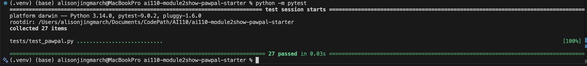
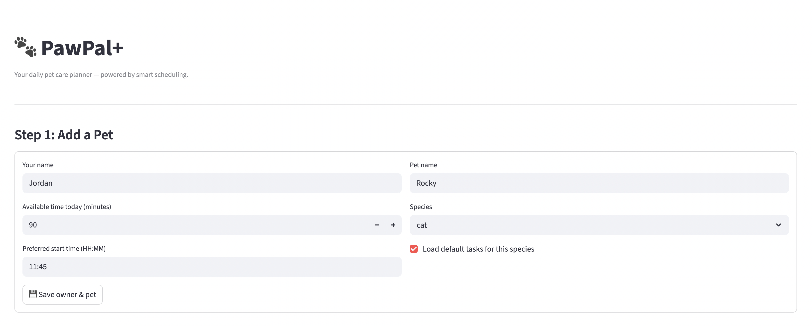
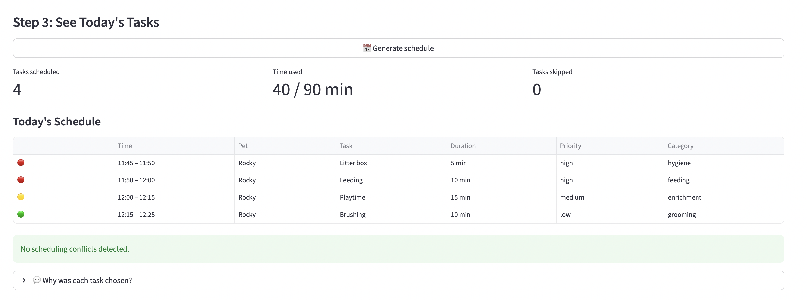
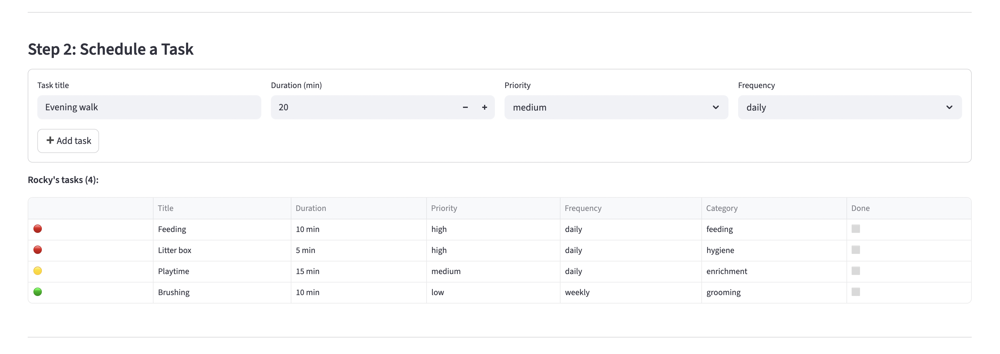
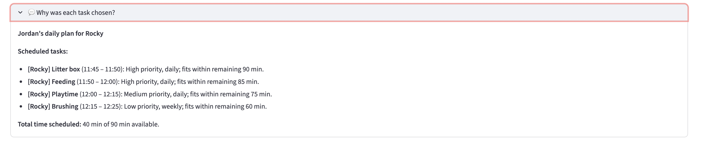

# PawPal+ (Module 2 Project)

You are building **PawPal+**, a Streamlit app that helps a pet owner plan care tasks for their pet.

## Scenario

A busy pet owner needs help staying consistent with pet care. They want an assistant that can:

- Track pet care tasks (walks, feeding, meds, enrichment, grooming, etc.)
- Consider constraints (time available, priority, owner preferences)
- Produce a daily plan and explain why it chose that plan

Your job is to design the system first (UML), then implement the logic in Python, then connect it to the Streamlit UI.

## What you will build

Your final app should:

- Let a user enter basic owner + pet info
- Let a user add/edit tasks (duration + priority at minimum)
- Generate a daily schedule/plan based on constraints and priorities
- Display the plan clearly (and ideally explain the reasoning)
- Include tests for the most important scheduling behaviors

## Getting started

### Setup

```bash
python -m venv .venv
source .venv/bin/activate  # Windows: .venv\Scripts\activate
pip install -r requirements.txt
```

### Suggested workflow

1. Read the scenario carefully and identify requirements and edge cases.
2. Draft a UML diagram (classes, attributes, methods, relationships).
3. Convert UML into Python class stubs (no logic yet).
4. Implement scheduling logic in small increments.
5. Add tests to verify key behaviors.
6. Connect your logic to the Streamlit UI in `app.py`.
7. Refine UML so it matches what you actually built.

<div align="center"><a href="https://mermaid.live/edit#pako:eNqNVk2P4jgQ_SuWT8wsoIbuhiaHvewc92Ok2dMKyTJxEaxO7KztzAzban77VuWLJCSokUgc1ytXud5LOW88tgp4xONUev9Fy8TJbG8Y_soZ9rf0r-ytmqHfL9-C0yZhQYcUOtPaBKYKJ4O2RmTaFAH8rVfutHU6nG8tRwf_FmDiEVMsAyTWdS0Ha1MW2yxPIYDqGBRiGSYeRGsVNNeBCJFbtGujgxCzT-xPa7rmTLrX1nnCrM00QHtx0slJNFtFBGXbR6gCRLBKnmfl9QYSrFA6DuhLt8rwvjddYr5CGOPFyAxuZ30Ose4RQnzJpAv9XftwqfCXykGmwgAoPwSRJi4s4LVrkkoJmpvR5aYsDjL7HWoAaecGkUAQORiF8UuYx91fww2AV3bvQlMrkX84yiINLfIad1DSv34YcB8oalm771Kn8pDCPbHDEZzDHH2QDuPr7KbeyOKF5RD8xwVKdUaPGf6nqkxmynm0xjJN-0ULBZbyMoIaZWMUTVsTh0LhGHFYn9H6fotPoIp0UOOq6pau0zlMRj_qNIBrUz2cO5u_64FIpCUUftZqacqj3xJwfUHrz8s3QIyL2YFHmEKNnEd0V-8Qd4ytSeSpNGj-QuCvOL5iFsJbFA5tqukmudTOTyS6EEcdPAqnoYIizxmKQqKYTNJtMwNq2uAfoKZqFDWXqmoGvnkUw7bQyZT5V53nIxh6oYIN2G-aI6RjbEpAGmtk0I8-Su5ABpMeCjmNqaGYY4q9ttW5D64H0x55OjdWastdM_xEqyYa0e-u-NXNiUqdHLPtzJQQKtJIJx9rJbUN34EJiwPpe0W9e8BUtO_5as_Z58WCRsvlZ3ygTCPSQ00ePfdwDxWuzL8L7K64WPxaj679IGJHOmioc9jK42qrsMtl43WVaoQt1qoibprv1TKMVMWP2AFSaxLPmihDj94u-oxF-L1hAnLs-wlW1mHA2uWHk_mH8FVlh-nRLG28SQBpxJOG1QcaLsznPHFa8egoUw9znoHDdx2feSmwPQ8nQD3wCIe1157vzTv65dL8Y23Go-AK9HS2SE7tOkVOH03152A761Bg4H6zhQk8Wq3W63IVHr3xnzx6fFgt1-vn1cvjeve0wf-cnxG1WW7Wz5vd0-PL6nm3XW2f3uf8vzLuw3K32WwftustItaPu-eXOQelg3V_1J-kdHv_HwBMUSg">
  </div>
</a>

### Testing PawPal+

Run the full test suite from the project root:

```bash
python -m pytest
```

The suite covers three core scheduling behaviors:

| Area | Test(s) | What is verified |
|---|---|---|
| **Sorting Correctness** | `test_scheduled_tasks_are_in_chronological_order` | All scheduled tasks are returned in ascending `start_time` order — no task is inserted out of sequence |
| **Recurrence Logic** | `test_daily_task_reappears_after_reset` | Marking a `frequency="daily"` task complete removes it from pending; calling `reset_daily_tasks()` restores it, modelling a new task for the following day |
| **Conflict Detection** | `test_scheduler_produces_no_duplicate_start_times`, `test_scheduler_no_overlapping_time_slots` | No two tasks share the same start time, and no task's end time bleeds into the next task's start time |

<div align="center"></div>

Confidence Level: ★★★★☆ (4/5)

27/27 tests pass. Here's the reasoning behind the rating:

| Factor | Assessment |
|---|---|
| **Core logic** | All task, pet, owner, and scheduler behaviors verified — strong foundation |
| **Happy-path coverage** | Sorting, recurrence, conflict detection all confirmed working |
| **Input validation** | Invalid priority, frequency, duration, and budget all raise correctly |
| **What keeps it from 5 stars** | No tests for multi-pet conflict detection, `weekly` task reset isolation, midnight-rollover edge cases, or the Streamlit UI layer — gaps identified in `Phase4_planning.md` remain untested |

| Layer | Tests | Result |
|---|---|---|
| Task model | 8 | All pass |
| Pet model | 5 | All pass |
| Owner model | 3 | All pass |
| Scheduler / DailyPlan | 8 | All pass |
| Sorting correctness | 1 | All pass |
| Recurrence logic | 1 | All pass |
| Conflict detection | 2 | All pass |
| **Total** | **27** | **27/27** |


| Component | Before | After |
|---|---|---|
| Layout | `centered` | `wide` — more room for tables |
| Task list | `st.table` (plain dict) | `st.dataframe` with colour-coded priority emoji badges |
| Schedule output | `st.table` | `st.dataframe` + 3 `st.metric` cards (tasks, time used, skipped) |
| Conflict warnings | One `st.warning` per message | Grouped under a `#### Conflicts Detected` header |
| No conflicts | Silent | `st.success("No scheduling conflicts detected.")` |
| Skipped tasks | Comma-joined `st.info` string | Full `st.dataframe` with pet, task, duration, reason columns |
| Buttons | Plain labels | Emoji labels + `use_container_width=True` |


## Features

### Core Scheduling
- **Priority-based scheduling** — tasks are sorted high → medium → low before fitting into the day; duration is used as a tiebreaker within the same priority level (`Scheduler._sort_by_priority`)
- **Greedy time-budget fitting** — tasks are placed into the schedule until the owner's available minutes are exhausted (`Scheduler._fits_in_budget`)
- **Force-include high-priority tasks** — high-priority tasks are always scheduled even if they exceed the remaining budget (`Scheduler.generate_plan`)
- **Preferred start time** — the schedule begins at the owner's chosen start time and builds contiguous time blocks from there

### Task Management
- **Daily recurrence** — daily tasks are reset to incomplete at the start of each new day (`Scheduler.reset_daily_tasks`)
- **Weekly recurrence** — weekly tasks reset only after 7+ calendar days since last completion, using `last_completed_date` (`Task.is_due_today`)
- **Task completion tracking** — `mark_complete()` flips the completed flag and records the completion date; `mark_incomplete()` reverses it
- **Species-default tasks** — loading a pet auto-populates appropriate tasks (e.g., dogs get walks, cats get litter box) (`Pet.load_default_tasks`)
- **Special needs injection** — pets with medication in their special needs automatically receive a high-priority daily medication task

### Plan Output
- **Chronological sorting** — the final schedule is displayed in ascending start-time order (`DailyPlan.sort_by_time`)
- **Conflict detection** — overlapping time slots are identified and surfaced as warnings (`DailyPlan.detect_conflicts`)
- **Per-pet filtering** — the plan can be filtered to show only one pet's tasks (`DailyPlan.filter_by_pet`)
- **Plain-language explanation** — each scheduled task includes a reason string describing why it was included or skipped (`DailyPlan.explain`)
- **Skipped task reporting** — tasks that didn't fit the budget are listed separately with pet, title, duration, and priority

### Multi-Pet Support
- **Multiple pets per owner** — an owner manages a roster of pets; tasks are retrieved across all of them as `(pet, task)` pairs
- **Per-pet task ownership** — each task belongs to a specific pet and carries that reference through to the final scheduled slot
- **Cross-pet pending filter** — `Owner.get_all_pending_tasks()` returns only incomplete tasks across every pet in one call

---

What's different from the Phase 1 UML:

| Class | What changed |
|---|---|
| **`Task`** | Added `frequency`, `completed`, `last_completed_date`; added `mark_complete()`, `mark_incomplete()`, `is_due_today()` |
| **`Pet`** | Now owns `tasks: list[Task]` directly; added `get_completed_tasks()`, `load_default_tasks()` |
| **`Owner`** | Changed `pet: Pet` → `pets: list[Pet]`; added `add_pet()`, `remove_pet()`, `get_all_tasks()`, `get_all_pending_tasks()` |
| **`Scheduler`** | No longer holds its own task list; reads from owner's pets at runtime; added `filter_pending_by_pet()`, `filter_by_status()`, `reset_daily_tasks()` |
| **`DailyPlan`** | Added `owner` reference; added `sort_by_time()`, `filter_by_pet()`, `detect_conflicts()` |
| **`ScheduledTask`** | Added `pet: Pet` reference (was only `task: Task` before) |


# Demo

### Run the app
```bash
streamlit run app.py
```

### Walkthrough

**Step 1 — Add a Pet**
Enter your name, daily time budget (minutes), preferred start time, pet name, and species.
Check "Load default tasks" to auto-populate species-appropriate care tasks.
Click **💾 Save owner & pet**.

<div align="center"></div>

**Step 2 — Schedule a Task**
Add custom tasks with a title, duration, priority, and frequency.
Each submission calls `pet.add_task(Task(...))` and updates the live task table with colour-coded priority badges (🔴 high · 🟡 medium · 🟢 low).

<div align="center"></div>

**Step 3 — See Today's Tasks**
Click **📅 Generate schedule** to run the scheduler.
The app displays:
- Three summary metrics — tasks scheduled, time used, tasks skipped
- A time-sorted schedule table (`DailyPlan.sort_by_time`)
- Conflict warnings if any time slots overlap (`DailyPlan.detect_conflicts`)
- A collapsible "Why was each task chosen?" explanation (`DailyPlan.explain`)
- A skipped-tasks table for anything that didn't fit the budget

<div align="center"></div>

<div align="center"></div>

### Terminal demo
```bash
python main.py
```
Runs a fully scripted demo with two pets (Mochi the dog, Luna the cat), six tasks, and a 90-minute budget — no browser required.

---


