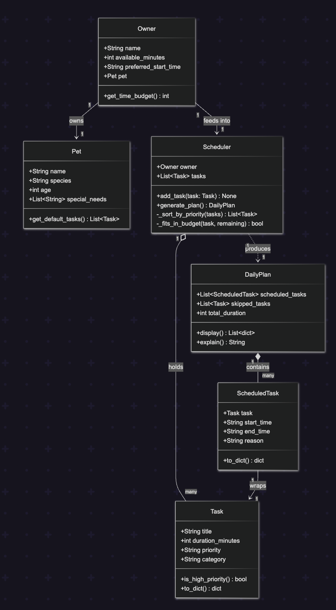
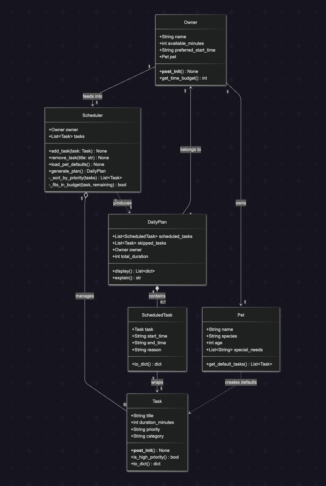
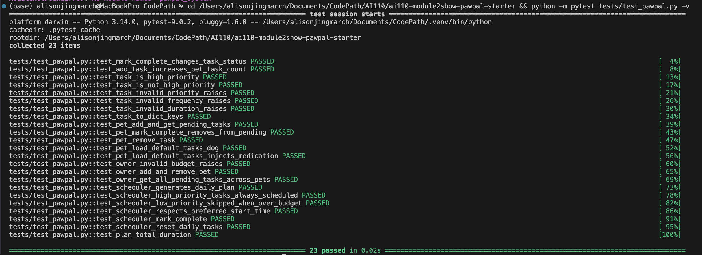

# PawPal+ Project Reflection

## 1. System Design

Based on the PawPal+ project, here are three core user actions the app should support:

1. **Add a pet care task**
The user enters a task name (e.g., "Morning walk"), duration in minutes, and priority (low/medium/high). This is already stubbed in the starter UI and is the primary data-entry action that feeds everything else.

2. **Generate a daily schedule**
The user clicks "Generate schedule" to produce an ordered, time-blocked plan for the day. The scheduler should pick and sequence tasks based on priority and available time, then explain why each task was chosen and when it happens.

3. **Set owner + pet context**
The user provides basic owner info (name, time available) and pet info (name, species, any preferences like medication timing). This context constrains the schedule, e.g., a cat owner gets different default tasks than a dog owner, and a busy owner with only 90 minutes gets a tighter plan.

These three map directly to the three layers the README asks you to build: input (owner/pet info) → data (tasks) → output (schedule). Everything else like editing tasks, viewing history, explaining reasoning is a refinement on top of these.

**a. Initial design**

My initial UML design centered on six classes organized into two layers: data objects (holding state) and logic objects (doing work).

- **`Task`** — represents a single care activity. Holds the task name, how long it takes, its priority level, and a category (e.g., feeding, exercise). Responsible for knowing whether it is high priority and serializing itself to a dictionary for display.
- **`Pet`** — represents the pet being cared for. Holds name, species, age, and any special needs (e.g., medication). Responsible for generating a default task list appropriate to its species.
- **`Owner`** — represents the person using the app. Holds their name, daily time budget, preferred start time, and a reference to their pet. Responsible for reporting the available time budget to the scheduler.
- **`Scheduler`** — the core logic class. Holds a reference to the owner and the full pool of tasks. Responsible for sorting tasks by priority and greedily fitting them into the owner's time budget to produce a daily plan.
- **`DailyPlan`** — the output artifact of the scheduler. Holds the list of scheduled tasks and the list of tasks that were skipped. Responsible for formatting the plan for display and generating a plain-language explanation of scheduling decisions.
- **`ScheduledTask`** — a lightweight wrapper around a `Task` that adds a start time, end time, and a reason string explaining why it was included. Responsible for representing one time-blocked slot in the final plan.

<div align="center"></div>


**b. Design changes**


Here is a full review of the skeleton:

Missing Relationships
1. Pet is never asked for its default tasks
Owner holds a Pet, and Pet knows how to produce default tasks — but nothing in Scheduler ever calls owner.pet.get_default_tasks(). There is a gap: who is responsible for loading the pet's defaults into the scheduler's task pool? You need either a Scheduler.load_defaults() method, or the caller (e.g., app.py) must do it manually before calling generate_plan().

2. Owner.preferred_start_time is unused
Scheduler never reads owner.preferred_start_time, so every plan will silently default to midnight or whatever hardcoded value you put in generate_plan. The scheduler needs to read this attribute when constructing the first ScheduledTask.

3. DailyPlan has no reference back to the Owner
The plan doesn't know whose plan it is. This matters when explain() formats output — it can't say "Jordan, here is your plan for Mochi" without that context. Consider passing owner into DailyPlan, or having explain() accept it as a parameter.

Potential Logic Bottlenecks
4. priority is an unconstrained string
Task.priority accepts any string. If a user passes "HIGH" or "urgent", is_high_priority() and _sort_by_priority() will silently break. Consider validating on construction with __post_init__ or using a constant like VALID_PRIORITIES = {"low", "medium", "high"}.

5. _sort_by_priority has no tiebreaker
Tasks at the same priority level will have unstable ordering. If two "high" priority tasks both exceed the remaining budget, which one gets force-included first? Without a secondary sort key (e.g., duration, insertion order), results will be unpredictable.

6. No remove_task method on Scheduler
add_task exists but there is no way to remove or edit a task. The Streamlit UI will eventually need this when a user wants to delete or update a task they added.

7. available_minutes has no floor
Nothing prevents Owner.available_minutes = 0 or a negative value. generate_plan() would then force-include every high-priority task and skip everything else — which may be correct behavior, but it should be an explicit decision, not an accidental one.

- Did your design change during implementation?

Here is the updated UML Diagram:

<div align="center"></div>

- If yes, describe at least one change and why you made it.

**What changed from the first version:**

| Change | Why |
|---|---|
| `Task.__post_init__` added | Validates `priority` is one of `low/medium/high` |
| `Owner.__post_init__` added | Guards against `available_minutes <= 0` |
| `Scheduler.remove_task()` added | UI needs ability to delete tasks |
| `Scheduler.load_pet_defaults()` added | Closes the gap between `Pet.get_default_tasks()` and the scheduler's task pool |
| `DailyPlan.owner` attribute added | Lets `explain()` say whose plan it is |
| `DailyPlan --> Owner` relationship added | Reflects the new ownership reference |
| `Pet ..> Task` dependency added | Makes explicit that `Pet` creates `Task` objects |


**Key architectural shifts**
Task — added frequency + completed

frequency: "daily" / "weekly" / "as-needed" — validated in __post_init__
completed: tracks whether the task is done today
mark_complete() / mark_incomplete() — clean state transitions
Pet — now owns its tasks

tasks: list[Task] lives on the pet, not the scheduler
add_task(), remove_task(), get_pending_tasks(), get_completed_tasks()
load_default_tasks() populates species defaults directly onto the pet
Owner — now manages multiple pets

pets: list[Pet] replaces the single pet field
add_pet() / remove_pet() to manage the roster
get_all_tasks() and get_all_pending_tasks() return (Pet, Task) pairs so the scheduler always knows which pet a task belongs to
Scheduler — now the true "brain"

No longer holds its own task list — it reads from owner.pets at runtime
get_all_pending() — retrieves tasks across all pets
mark_complete(pet_name, task_title) — manages state across the pet graph
reset_daily_tasks() — resets all daily tasks at the start of a new day
generate_plan() schedules across all pets, preserving the pet reference in each ScheduledTask


---

## 2. Scheduling Logic and Tradeoffs

**a. Constraints and priorities**

- What constraints does your scheduler consider (for example: time, priority, preferences)?
- How did you decide which constraints mattered most?

**b. Tradeoffs**

- Describe one tradeoff your scheduler makes.
- Why is that tradeoff reasonable for this scenario?

---

## 3. AI Collaboration

**a. How you used AI**

- How did you use AI tools during this project (for example: design brainstorming, debugging, refactoring)?
- What kinds of prompts or questions were most helpful?

**b. Judgment and verification**

- Describe one moment where you did not accept an AI suggestion as-is.
- How did you evaluate or verify what the AI suggested?

---

## 4. Testing and Verification

**a. What you tested**

I wrote two focused unit tests targeting the most fundamental behaviors in the system:

**Test 1 — Task Completion (`test_mark_complete_changes_task_status`)**
```python
def test_mark_complete_changes_task_status():
    task = Task(title="Feeding", duration_minutes=10, priority="high", frequency="daily")
    assert task.completed is False
    task.mark_complete()
    assert task.completed is True
```
This test verifies that calling `mark_complete()` actually flips `completed` from `False` to `True`. It checks the state *before and after* the call so a no-op implementation cannot accidentally pass. This matters because the scheduler relies on `completed` to filter out finished tasks — if this flag doesn't update correctly, pets would be assigned duplicate tasks every run.

**Test 2 — Task Addition (`test_add_task_increases_pet_task_count`)**
```python
def test_add_task_increases_pet_task_count():
    pet = Pet(name="Mochi", species="dog")
    assert len(pet.tasks) == 0
    pet.add_task(Task(title="Walk", duration_minutes=30, priority="high", frequency="daily"))
    assert len(pet.tasks) == 1
    pet.add_task(Task(title="Feeding", duration_minutes=10, priority="high", frequency="daily"))
    assert len(pet.tasks) == 2
```
This test verifies that each call to `add_task()` increases the pet's task list by exactly one. It checks incrementally (0 → 1 → 2) rather than just the final count, which would catch a bug where only the last-added task is kept.

<div align="center"></div>

**b. Confidence**

- How confident are you that your scheduler works correctly?
- What edge cases would you test next if you had more time?

---

## 5. Reflection

**a. What went well**

- What part of this project are you most satisfied with?

**b. What you would improve**

- If you had another iteration, what would you improve or redesign?

**c. Key takeaway**

- What is one important thing you learned about designing systems or working with AI on this project?
